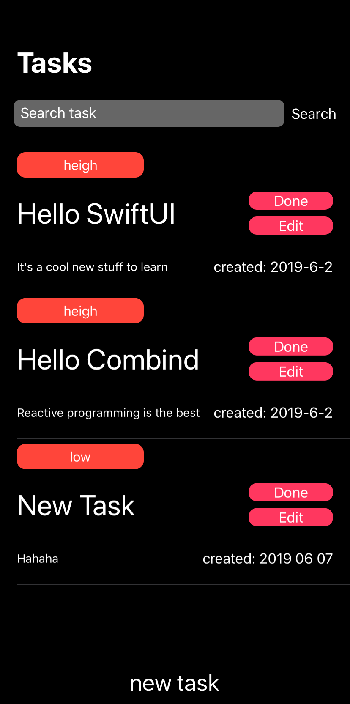
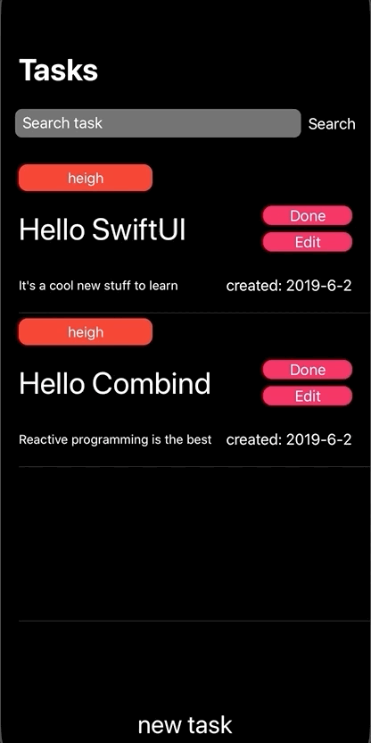

## Todo Combine SwiftUI

It's an experiment project for the brand new SwiftUI + Combine + restful API with dark mode

## Build

* follow [restfult to-do-api](https://github.com/jamfly/golang-to-do) to run backend

* download Xcode 11 beta

* read [SwiftUI tutorial](https://developer.apple.com/tutorials/swiftui/creating-and-combining-views)

  

## Requirements

* Xcode 11 beta
* Swift 5.1

## Issue 

the following is what I currently dont know how to implement, if you guys know how to do, please just open a PR

- [ ] add push/present to next view from  navigationBarItem
- [ ] add picker 
- [ ] change back button color
- [ ] change textfiled height
- [ ] change viewModel name it will lead xcode hangs on compilation
- [ ] dismiss itself while tap new task

## Todo

- [ ] delete task while tap `done` button
- [ ] add animation
# - [ ] add edit view